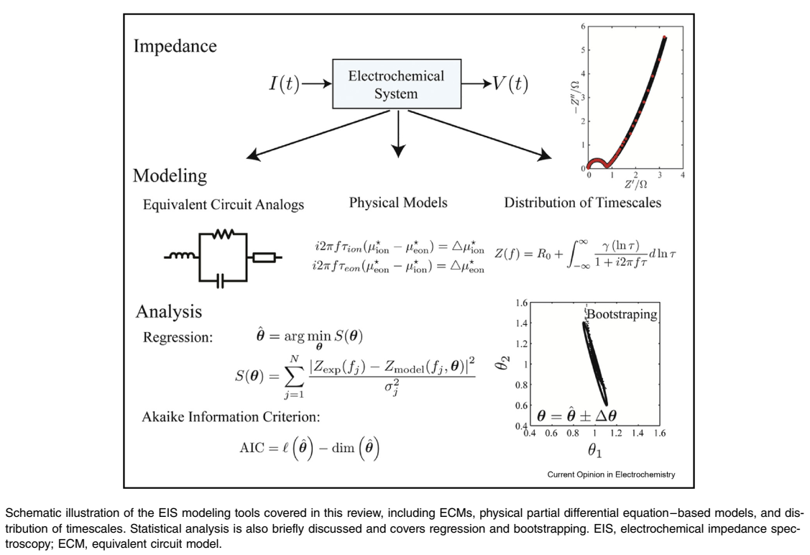
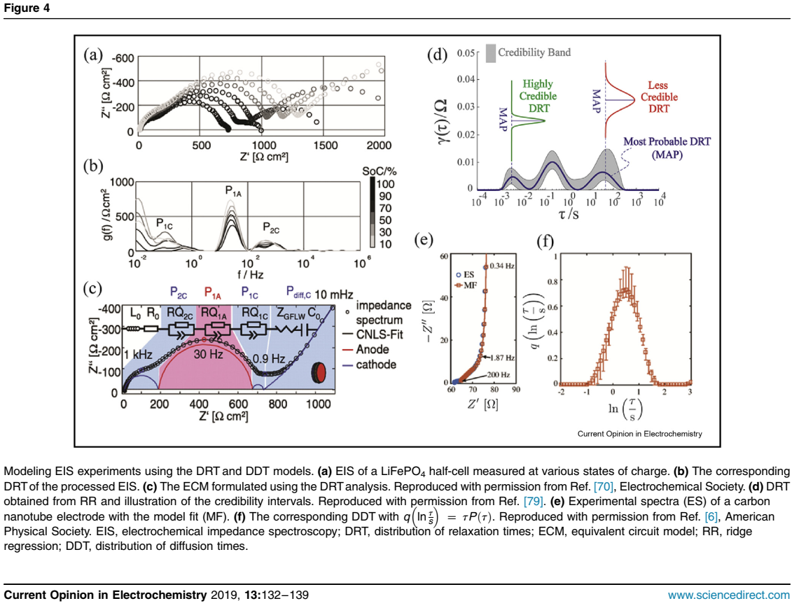
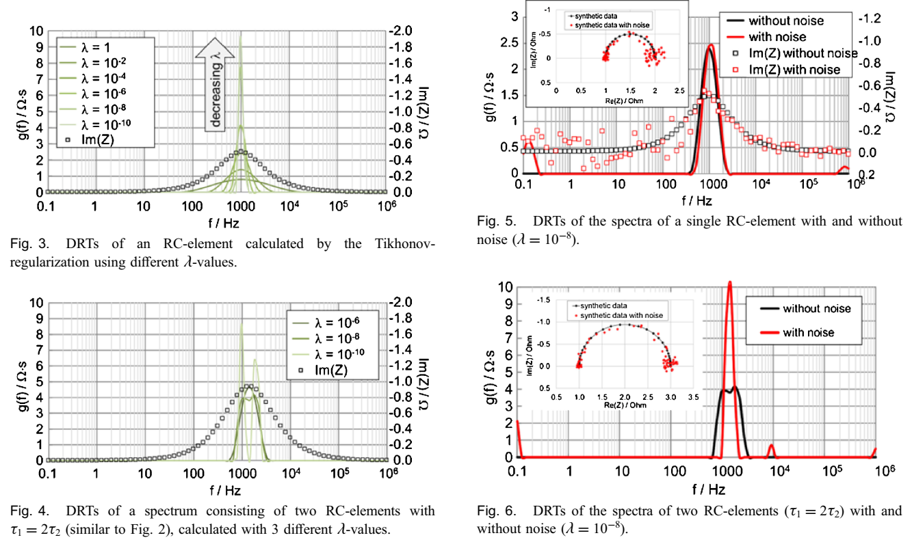
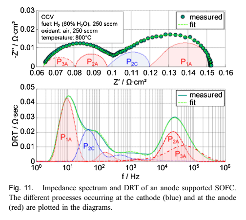
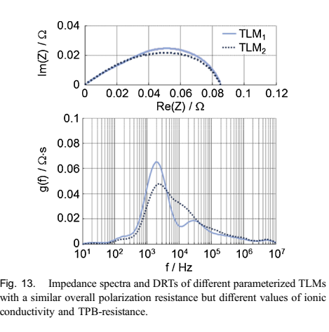
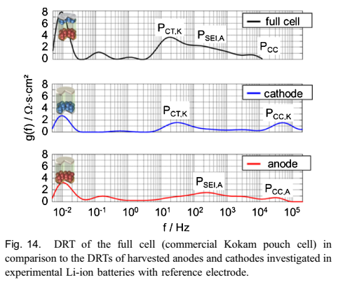

# DRT 文献总结

2021-09-07 Tue

## Ciucci, F., Modeling electrochemical impedance spectroscopy. Current Opinion in Electrochemistry, 2019. 13: p. 132-139.

> Ciucci的一篇Summary，介绍了EIS处理的三种进入路径。

### Equivalent circuits models（ECMs)

需要对元件、体系模型有先验的了解，最核心的问题是寻找到一个**合适的**等效电路模型。有一些自动化的软件处理包，但对于复杂的多元件体系，多参数拟合会变得极具复杂。总的来说，选择一个合适的模型极具挑战性。

> (ECMs is) A mere development of an analogy (which is now done by various computer programs) represents an incomplete analysis of the data.  
>
> (ECM方法)仅仅是在类比方面的发展（现在已经可由许多软件完成）表明对数据不完整的分析。
>
> -- Prof. D.D Macdonald

### Physical Models

物理模型通常被限定在特定的体系当中，从一系列方程和边界条件的解算中得出。相较于临时（*ad hoc*）的ECMs，物理模型提供了更多物理和化学的信息。

- e.g. 1. 离子晶体 ionic solids

  

  适用于离子电子混合导体（mixed ionic-electronic conductors MIECs）

  可被简化为三条通路（rails）：

  - 中心电容通路：泊松方程Poisson Equation
  - 离子电阻通路：Nernst-Planck conduction of ions through an infinite number of capacitances
  - 电子电阻通路：that of electrons

  电中性版本如图a所示，两条传输线和一个所谓的化学电容。the two transport rails for electrons (eons) and ions (ions) are connected by an infinite set of infinitesimal capacitors, which represent the so-called chemical capacitance, a quantity associated to the concentration of defects in
  MIECs  

- e.g. 2. 多孔材料 porous materials

  该物理模型不仅适用于多孔材料，也用于研究光电极、染料敏化太阳能电池、电池和燃料电池领域。

  > Analytical models stemming from physical principles are not limited to solid ionic materials but have also been used to analyze photoelectrodes [29], dye-sensitized solar cells [30], batteries [31-36], and fuel cells [37-39]  

  该模型是一个复杂模型，解析解并不是必要的，从边界条件计算数值解也是可行的。

- 多维模型 multidimensional models

  

###  Distribution of relaxation, diffusion, and capacitance times

DRT分析的基本思路：记录电化学体系被小幅度扰动（如电流脉冲）时，体系响应（如电压）的弛豫时间分布。

> The DRT aims at estimating the relaxation characteristics of an EC system and relies on the premise that if we subject an EC system to a smallstep perturbation (e.g. a current impulse), the response (e.g. the voltage) will decay exponentially with a particular distribution of timescales.

$$
   Z(f)=R_0 + i2\pi fL_0 +\int_0^{\infty}\frac{\gamma(\ln\tau)}{1+2\pi f \tau}{d \ln\tau}
$$

> where R0 is an ohmic resistance, L0 is an inductance, and *r(ln r) = rg(r)* is a timescale distribution [62].  

DRT分析的难点在于去卷积$\gamma(\ln \gamma)$的过程是关键的一个步骤，因为原方程有可能是不适定的。

> It must be noted, however, that deconvolving r(ln r) from is not a trivial task because the underlying problem is ill posed.   

在去卷积方法确定后，基于此技术可以发展出电容时间分布：
$$
   C(f)=\frac{1}{i2\pi fZ(f)}
$$
   微分电容由如下式获得：
$$
   C(f)=\int_{-\infty}^{+\infty}\frac{\tau(\ln \tau)}{1+i2\pi f\tau}d\ln\tau
$$
   扩散时间分布（distribution of diffusion times DDT）
$$
   Y(f)=\frac{1}{Z(f)}=\int_0^{\infty}\frac{P(\tau)}{z_D(f,\tau)}d\tau
$$
   where $P(\tau)$ is the distribution of diffusion times (DDT) and $z_D(f,\tau)$ is the impedance of an individual finite-length model  

 

## Ivers, T., et al., Evaluation of electrochemical impedance spectra by the distribution of relaxation times. Journal of the Ceramic Society of Japan, 2017. 125(4): p. 193-201.

> 介绍了DRT的一些基本原则和应用

### 原则

DRT最早是1907年被Schweidler引入到电介质和电容分析中，1913年被Wagner进一步发展，但其应用发展缓慢。2002年，Schichlein发展了在SOFCs中应用DRT分析的方法学，于是进一步拓展开来。

- DRT的λ选值对谱图解析度影响巨大：

  - λ应该尽可能的小 -> 以提高对时间常数的解析度 （Fig.3 4）
  - λ不能过小 -> 会包含噪音过程，产生人造的诡峰 (Fig. 7)

- 噪音对DRT结果的印象巨大，因此一个高质量的EIS谱图对DRT分析至关重要(Fig.5 6)

  > Any kind of noise or errors in the spectra can have a severe impact on the calculated DRT.   

### DRT的应用：

- DRT-analysis of fuel cells  

  DRT描述隐含的假设是体系可以被描述为无限多个[RC]电路的串联形式，结合DRT确定时间常数，再提出等效电路（ECMs）是一种较好的选择。

  

  > P1A: gas diffusion in the anode substrate (including contact mesh and anode flowfield) described by a finite length Warburg element
  > P2A&P3A: coupling of H2-electro-oxidation, ionic transport and gas diffusion in the anode functional layer (AFL), approximated by two RQ-elements
  > P1C: gas diffusion in the cathode (including contact mesh and cathode flow field), approximated by an RQ element (only at pO2<<)
  > P2C: oxygen reduction in a mixed ionic-electronic conducting cathode described by a Gerischer element

  **麻烦点在于确定时间常数的归属**：现在确定归属的方法是经验+控制变量（因而需要大量的实验作为基础）

  DRT在区分三相界线（TPB）的传输线模型上（Transmission line model TLM）的区别上具有更高的解析度。

  

  !> 模型的参数化并不只单单依赖于DRT，也需要别的手段辅助进行。DRT只是其中的一种。

- DRT on batteries

  

  在锂电池中的优势是可以在无法使用参考电极时区分出阴阳极过程。

