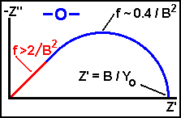

# O Element

From site: http://consultrsr.net/resources/eis/diff-o.htm

## Diffusion Circuit Elements - O

The most commonly used diffusion circuit element is the Warburg, but it is not always the most appropriate one! It is often wise (and fairly common) to use a **rotating disk electrode** (RDE) in impedance studies. It is particularly wise when studying reactions involving diffusing species when the "DC" current is different than zero -- studies at potentials away from the open circuit or equilibrium potential ( away from the rest potential or the corrosion potential: ). If a stationery electrode and unstirred solution were used instead, the current would slowly decay. The changing and non-steady state "DC" current would corrupt the interpretation of the lower frequency measurements.

In systems such as the RDE, there is a region close to the electrode in which mass transport happens only by diffusion. Outside of this "Nernst Diffusion Layer" the solution is homogeneous due to the stirring produced by the rotating electrode assembly. The concentration of the diffusing species in the bulk solution remains unchanged by the experiment (*i.e.*, the reaction vessel is big!) The material simply diffuses through the Nernst Diffusion Layer (NDL) to reach the electrode. The impedance in this case is described by the so-called **O** circuit element.

In the [Gamry Echem AnalystTM](http://www.gamry.com/) software it is called the "porous bounded Warburg." This name is more descriptive of what the element really stands for. I have also seen it referred to as a **Nernst** circuit element because of its application to the Nernst Diffusion Layer. It is also referred to as an **OFLD** - **O**pen **F**inite-**L**ength **D**iffusion circuit element.

The RDE is not the only case where the **O** element might be seen. Often the rate of corrosion is limited by the slow diffusion of oxygen through a coating or a passive film. This situation is quite similar to the RDE example, above. The oxygen concentration is homogeneous in the solution phase due to mixing and the concentration just outside the coating or film is fixed and constant. The impedance in this example also fits the **O** element model.

A Nyquist plot for the O element

The figure shows the Nyquist plot for the **O** diffusion element. The **O** element is characterized by two parameters, an "admittance" parameter, **Yo**, and a "time constant" parameter, **B** (units: sec**½** ). At high frequency ( f > 2 / B2 ) the **O** circuit element is indistinguishable from a Warburg impedance! This frequency range is shown in **red** in the figure. Since the time for a molecule to diffuse across the thin layer is much longer than the period of the AC stimulus applied, the electrode does not 'see' that the film or coating is of finite thickness.

## Equations for the O element.

The equations for the complex admittance ( **$Y(\omega) $** ) and complex impedance (  **$Z(\omega) $**) are given by the equations below. The **O** circuit element gets its name from the hyperbolic **cotangent** ( coth[] ) admittance response.

**Yo** has the same [definition](http://consultrsr.net/resources/eis/warburg2.htm) as for the Warburg impedance. **Yo** can be used to calculate a diffusion coefficient for the mobile species **within** the film, coating, or in the NDL using the same [equations](http://consultrsr.net/resources/eis/warburg2.htm). For large values of the argument (the **red** region of the Nyquist plot, above), the *tanh* and *coth* functions both approach unity and the impedance has the same  dependence as the Warburg. This region can be used to estimate **Yo**.

If the thickness of the NDL (for RDE) or the thickness of the film is , then the constant **B** is related to that thickness and the diffusion coefficient, D. **B** characterizes the time it takes for a reactant to diffuse through the NDL or thin film.

As pointed out on the [Gamry web site](http://www.gamry.com/Newsletter/2005Feb/RDE_Impedance.htm), **B** is a function of rotation speed for a RDE since the thickness of the NDL depends on rate of rotation. Varying the rotation speed is one way to vary the contribution of the **O** element and to test the validity of your model. For a RDE, **B** is inversely proportional to the square root of the rotation rate of the electrode.

A recent publication ( [Ref 3](http://consultrsr.net/resources/eis/diff-o.htm#ref) ) discusses the case of diffusion to a RDE followed by a reversible electron transfer.

## REFERENCE

(1) [Boukamp, B](http://www.ims.tnw.utwente.nl/people/bab/bab.doc/)., "Equivalent Circuit (EQUIVCRT.PAS) Users Manual", Univ. Twente, Enschede, the Netherlands, 1989.
(2) "[Diffusion Impedance for Planar, Cylindrical, and Spherical Geometry](http://dx.doi.org/10.1016/0013-4686(94)E0192-3)", T. Jacobsen, K West, *Electrochimica Acta*, **40**(1995), 255.
(3) "[Impedance of a rotating disc electrode with a reversible reaction](http://dx.doi.org/10.1007/s10800-004-9304-8)", M Boillot, S Didierjean, F Lapicque, *J. Appl. Electrochem.*, **34** (2004) 1191-1197.

