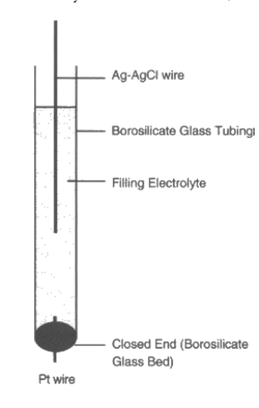
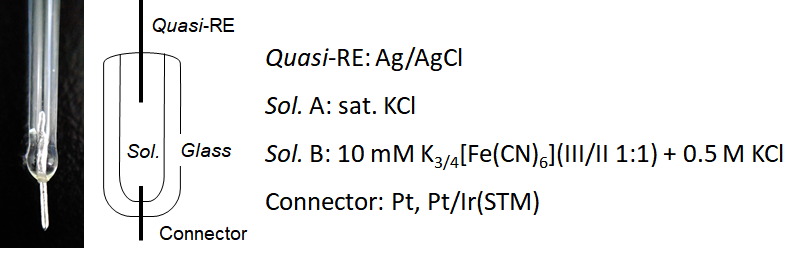
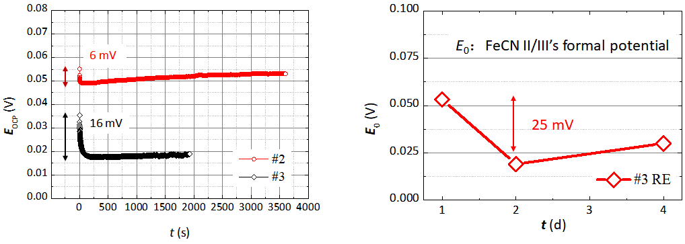

# 水氧无关的微型Ag/AgCl参比电极

## 简述

Del Valle, M. A.[^1]提出一种Easy-To-Make的Ag/AgCl参比电极，在硼硅酸盐玻璃管中嵌入一根铂丝作为电势导体，Ag-AgCl作为真正参比电极，玻璃管中填充3.5 M的KCl作为支持电解质，并添加$N(NH_3)_4Cl$将电极电势调至0.000 V *vs* SCE. 如下图所示：

据文章所言，该参比可稳定使用达2月。

## 制作工艺

在制作中，我们结合本实验室情况，改用0.5 M KCl为支持电解质的和10 mM $K_{3/4}[Fe(CN)_6](III/II= 1:1) $ 作为填充液。

实物和示意图下图所示：

### Step-by-Step

**Connector**

​	1.Pt或Pt/Ir丝洗净、灼烧退火后，平行放置于*Φ*2的玻璃管中，深入管内5~7 mm，

​	2.将玻璃管保持水平，置于火焰外焰旋转加热，以使玻璃与金属烧结；注意调整旋转速度，使玻璃管均匀受热，以防止金属端下垂

​	3.烧结完成后，保持玻璃管旋转离开火焰，在外焰外部热空气附近保持一定时间，**务必保持缓慢降温**，避免形成孔隙

**Quasi-RE: Ag/AgCl**

​	1.将银丝打磨后作为阴极浸入$Ag^+$电镀液中，以10 mA/cm$^2$电流电镀30 min

​	2.镀过的银丝冲洗干净，去除浮渣，作为阳极置于 1 M HCl中，以3 mA/cm$^2$恒电流氯化30 min

​	3.置于*sat.* KCl中避光陈化 24 h

**注入溶液及组装：**

1.用细针筒缓慢注入溶液（sol.），管内填充溶液仅1 mL左右，要非常注意避免形成气泡，RE插入时须保持管内充满溶液，以防引入新的气泡

2.组装时，cover内侧、玻璃管外侧及其它连接处涂薄层**AB胶**，尽量避免形成缝隙，造成溶液挥发

**注意：由于溶液量极小，密封质量直接决定了参比电极的好坏。**

## 评估

**小结**：

1.参比电极电位随时间仍有略微偏移，但该偏移在可接受的范围（~10 mV）

2.**封装问题比较突出**，溶液的挥发（原本溶液量就不足1 mL）会造成电极电位急遽下降甚至断路，**封装好的RE可以使用一年（电位有漂移，久置须重新标定）**

3.陈化会显著的增强参比电极稳定性，新制备的参比电极电位会有较大漂移。

[^1]:*J. Chem. Educ.* 2000, 77, 1, 97  https://doi.org/10.1021/ed077p97

