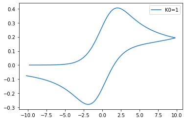
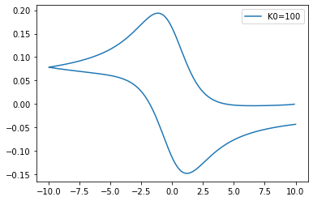
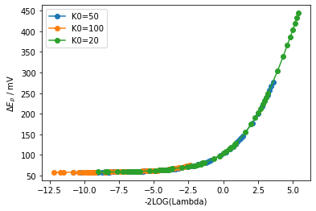

# CV模拟

reference: Understanding voltammetry


## Nernst机理

```python
# -*- coding: utf-8 -*-
"""
Created on Mon May  9 14:47:27 2022

@author: jonah
"""
import copy

import numpy
import numpy.matlib
import scipy.linalg
import matplotlib.pyplot as plt


theta_i = -10.0;
theta_v = 10.0;
sigma = 1;

deltaTheta = 0.2;
deltaX = 0.1;

deltaT = deltaTheta / sigma;
maxT = 2.0*numpy.abs(theta_v-theta_i)/sigma;
maxX = 6.0*numpy.sqrt(maxT)
iterX = int(maxX//deltaX)
iterT = int(maxT//deltaT)


theta = theta_i

#B-V
K0 = 1
a = 0.5


# deltXArray
deltaXlist = []
increaseRation = 1.01
XBorder = 1.0*numpy.sqrt(maxT)
_sum = 0.0
_deltaX = deltaX
while _sum < maxX:
    if _sum > XBorder:
        _deltaX = _deltaX * increaseRation    
        
    deltaXlist.append(_deltaX)
    _sum = _sum + deltaXlist[-1]
    

deltaXarray = numpy.array(deltaXlist)

lambdaArray = deltaT/(deltaXarray * deltaXarray)

# lamda = deltaT/(deltaX*deltaX)

# print(lamda)

alpha = -lambdaArray;
beta = (1.0 + 2*lambdaArray)
gamma = -lambdaArray

# update iterX

iterX = len(deltaXarray)
P = numpy.matlib.zeros((iterX,iterX))

for _r in range(iterX):
    if _r > 0 and _r < iterX-1:
        P[_r,_r-1] = alpha[_r]
        P[_r,_r] = beta[_r]
        P[_r,_r+1] = gamma[_r]


# P[0,0] = 1.0
# P[0,1] =  0

P[0,0] = 1 + deltaX * numpy.exp(-a*theta) * K0 *( 1 + numpy.exp(theta))
P[0,1] = -1.0

P[-1,-1]=beta[-1]
P[-1,-2]=alpha[-1]    


def surficialConcentration(theta):
    # #Nernst
    # c = 1.0/(1.0 + numpy.exp(theta))
    
    #B-V
    global deltaX
    global K0
    global a
    
    f = numpy.exp(-a*theta)
    
    
    c = deltaX * f * K0 #* numpy.exp(theta)
    
    
    return c

Cinit = numpy.ones(iterX)

# Cinit[0] = 1/(1 + numpy.exp(theta))
#B-V
Cinit[0] = deltaX * numpy.exp(-a*theta) * numpy.exp(theta) * K0
# 
Cinit[-1] = 1

C=Cinit


flux = numpy.zeros(iterT)

thetaArray = numpy.zeros(iterT)


tmpC = scipy.linalg.solve(P,Cinit)


for t in range(iterT):
    if t < iterT//2:
        theta = theta + deltaTheta
    else:
        theta = theta - deltaTheta
        # 
    
    P[0,0] = 1 + deltaX * numpy.exp(-a*theta) * K0 *( 1 + numpy.exp(theta))

    # 都随着theta变化，每次都要更新
    C[0] = surficialConcentration(theta)
    # C[0] = deltaX * numpy.exp(-a*theta) * numpy.exp(theta) * K0
    C[-1]= 1   
    
    C = scipy.linalg.solve(P,C)

    thetaArray[t] = theta
    
    flux[t] = (-C[2] + 4*C[1] - 3*C[0])/(2.0*deltaX)
 

plt.plot(thetaArray,flux,label= f'K0={K0}')


plt.legend()
```


模拟结果：




## Catalytic Mechsim

```python
# -*- coding: utf-8 -*-
"""
Created on Tue May 10 13:41:53 2022

@author: jonah
"""
import scipy
import scipy.linalg

import numpy
import numpy.matlib
import matplotlib.pyplot as plt


theta_i = 10.0;
theta_v = -10.0;
sigma = 0.2;

deltaTheta = 0.1;
deltaX = 0.1;

deltaT = deltaTheta / sigma;
maxT = 2.0*numpy.abs(theta_v-theta_i)/sigma;
maxX = 6.0*numpy.sqrt(maxT)
iterX = int(maxX//deltaX)
iterT = int(maxT//deltaT)

CBinit = 0

theta = theta_i

dB = 1

#B-V
K0 =100
a = 0.5


K1 = 0.001
Km1= 0.001

# get XArray
deltaXlist = []
increaseRation = 1.01
XBorder = 1.0*numpy.sqrt(maxT)
_sum = 0.0
_deltaX = deltaX
while _sum < maxX:
    if _sum > XBorder:
        _deltaX = _deltaX * increaseRation    
        
    deltaXlist.append(deltaX)
    _sum = _sum + deltaXlist[-1]
    

deltaXarray = numpy.array(deltaXlist)
iterX = len(deltaXarray)


def surficialConcentration(theta,mechanismName):
    global deltaX
    global K0
    global a
    
    if "Nernst" == mechanismName:
        return 1.0/(1.0 + numpy.exp(theta))
    if "BV" == mechanismName:
        f = numpy.exp(-a*theta)
        return deltaX * f * K0 
    if "Macus"== mechanismName:
        pass
    


# try to construct the P matrix
lambdaArray = deltaT/(deltaXarray * deltaXarray)

alpha = -lambdaArray
gamma = -lambdaArray

alpha[-1] = 0

betaA = (1 + 2*lambdaArray + Km1*deltaT)
betaB = (1 + 2*lambdaArray + K1 *deltaT)

betaA[-1] = 1
betaB[-1] = 1


P = numpy.matlib.zeros((2*iterX,2*iterX))
for _r in range(iterX):
    if _r > 0 and _r < iterX-1:
        rA = 2 * _r
        P[rA,rA-2] = alpha[_r]
        P[rA,rA-1] = 0
        P[rA,rA]   = betaA[_r]
        P[rA,rA+1] = -K1 * deltaT
        P[rA,rA+2] = gamma[_r]
        
        rB = 2 * _r + 1
        P[rB,rB-2] = alpha[_r]
        P[rB,rB-1] = -Km1 * deltaT
        P[rB,rB]   = betaB[_r]
        P[rB,rB+1] = 0
        P[rB,rB+2] = gamma[_r]


Cinit = numpy.ones(2*iterX)

for _it in range(2*iterX):
    if _it%2 == 1:
        Cinit[_it] = CBinit

# P[0,:] P[1,:]  theta depedence
cRed = surficialConcentration(theta, "BV")
cOxi  = numpy.exp(theta) * cRed
 
P[0,0] = 1.0 + cRed
P[0,1] = -cOxi
P[0,2] = -1

P[1,0] = - 1.0/dB * cRed
P[1,1] = 1.0 + 1.0/dB * cOxi
P[1,2] = 0
P[1,3] = -1

P[-2,-4] = alpha[-1]
P[-2,-2] = betaA[-1]

P[-1,-3] = alpha[-1]
P[-1,-1] = betaB[-1]


Cinit[0]  = 0
Cinit[1]  = 0
Cinit[-2] = 1.0
Cinit[-1] = CBinit


# solve
C=Cinit
flux = numpy.zeros(iterT)
thetaArray = numpy.zeros(iterT)

tmpC = Cinit
tmpC = scipy.linalg.solve(P,Cinit)

for t in range(iterT):
# for t in range(150):
    if t < iterT//2:
        theta = theta - deltaTheta
    else:
        theta = theta + deltaTheta
        # 
    # P[0,:] P[1,:]  theta depedence
    cRed = surficialConcentration(theta, "BV")
    cOxi  =  cRed * numpy.exp(theta)
     
    P[0,0] = 1.0 + cRed
    P[0,1] = -cOxi
    P[0,2] = -1

    P[1,0] = - 1.0/dB * cRed
    P[1,1] = 1.0 + 1.0/dB * cOxi
    P[1,2] = 0
    P[1,3] = -1

    P[-2,-4] = 0
    P[-2,-2] = 1

    P[-1,-3] = 0
    P[-1,-1] = 1


    C[0]  = 0
    C[1]  = 0
    C[-2] = 1.0
    C[-1] = CBinit
  
    
  
    
    C = scipy.linalg.solve(P,C)
    thetaArray[t] = theta
    flux[t] = (-C[4] + 4*C[2] - 3*C[0])/(2.0*deltaX)
 

plt.plot(thetaArray,flux,label= f'K0={K0}')


plt.legend()

```

结果：




## Nernst机理下扫速随着动力学的变化趋势

> ! it runs a very long time

```python
theta_i = -20.0;
theta_v = 20.0;
sigma = 100
deltaTheta = 0.02;
deltaX = 0.1;


#B-V
K0 = 100
a = 0.5

thetaArray = generateThetaArray(theta_i,theta_v,deltaTheta)

sAry = numpy.array([0.05,0.1,0.2,0.5,1,2,5,10,20,50,100,200,500,800,1000,2000,5000])
K0Ary = [0.5,1,5,10,100,1000]
import scipy.signal as ss
peaks = []

for _k in K0Ary:
    K0 = _k
    peaks = []
    for _s in sAry:
        initialise(theta_i,theta_v,_s,deltaTheta)
        P = generatePMatrix(generateDeltaXArray(deltaX,increaseRatio = 1.01))
        C = numpy.ones(iterX)
        flux = performSimulation(thetaArray)
    
        peaks.extend(ss.find_peaks(numpy.abs(flux))[0])
    
    nPeaks = numpy.array(peaks).reshape(-1,2)
    dE = [(thetaArray[_pk[0]]-thetaArray[_pk[1]]) for _pk in nPeaks]
    
    plt.plot(numpy.log(sAry/38.93),numpy.array(dE)*25.68,label=f'K0={K0}')

plt.xlabel('LOG(v)')
plt.ylabel('$\Delta E_{p}$ / mV')
plt.legend()
```





## 峰电位差与扫速、未补偿电阻的关系

```python
 import numpy as np
 import os

Ei = -0.5; #in Volt
Ef = +0.5; #in Volt
Eo = 0; # in Volt
S = 0.1; # in cm2
C0 = 0.001; #in mol/L
T = 298.15; #in K
D = 1e-6; #in cm2/s
Ru = 100; #in Ohm
Cd = 1e-6 #in F
ks = 0.1 #in cm/s
vAry=[0.1,0.2,0.5,0.8,1.0,2,5,8,10,20,50,80,100,200,500,1000,2000]; #in Volt/s

for _v in vAry:
    with open("input.txt",'w') as _f:
        _f.write("%f\n%f\n%f\n%f\n%f\n%f\n%f\n%f\n%f\n%f\n%f\n"%(Ei,Ef,Eo,S,C0,T,D,Ru,Cd,ks,_v))
        rv=os.system("CV_Simulation.exe")

lst=[]
for f in os.listdir('./'):
    if f.startswith('stdout-'):
        print(f)
        with open(f,'r') as _f:
            _v = f.split('-')[1][:-6]
            lmbd = ks*np.sqrt((8.314*T)/(96487*float(_v)*D))
            dEp = _f.readlines()[-1][10:-2]
            lst += [float(_v),float(dEp)]

np.savetxt(f'K:/v-dEp-Ru={Ru}.txt', np.reshape(np.array(lst),(len(lst)//2,2)),fmt='%s')
```


