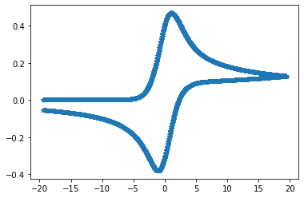

# CV模拟

reference: Understanding voltammetry

## Nernst机理

```python
# -*- coding: utf-8 -*-
"""
Created on Mon May  9 14:47:27 2022

@author: jonah
"""
import copy

import numpy
import numpy.matlib
import scipy.linalg
import matplotlib.pyplot as plt


theta_i = -10.0;
theta_v = 10.0;
sigma = 1;

deltaTheta = 0.2;
deltaX = 0.1;

deltaT = deltaTheta / sigma;
maxT = 2.0*numpy.abs(theta_v-theta_i)/sigma;
maxX = 6.0*numpy.sqrt(maxT)
iterX = int(maxX//deltaX)
iterT = int(maxT//deltaT)


theta = theta_i

#B-V
K0 = 1
a = 0.5


# deltXArray
deltaXlist = []
increaseRation = 1.01
XBorder = 1.0*numpy.sqrt(maxT)
_sum = 0.0
_deltaX = deltaX
while _sum < maxX:
    if _sum > XBorder:
        _deltaX = _deltaX * increaseRation    

    deltaXlist.append(_deltaX)
    _sum = _sum + deltaXlist[-1]


deltaXarray = numpy.array(deltaXlist)

lambdaArray = deltaT/(deltaXarray * deltaXarray)

# lamda = deltaT/(deltaX*deltaX)

# print(lamda)

alpha = -lambdaArray;
beta = (1.0 + 2*lambdaArray)
gamma = -lambdaArray

# update iterX

iterX = len(deltaXarray)
P = numpy.matlib.zeros((iterX,iterX))

for _r in range(iterX):
    if _r > 0 and _r < iterX-1:
        P[_r,_r-1] = alpha[_r]
        P[_r,_r] = beta[_r]
        P[_r,_r+1] = gamma[_r]


# P[0,0] = 1.0
# P[0,1] =  0

P[0,0] = 1 + deltaX * numpy.exp(-a*theta) * K0 *( 1 + numpy.exp(theta))
P[0,1] = -1.0

P[-1,-1]=beta[-1]
P[-1,-2]=alpha[-1]    


def surficialConcentration(theta):
    # #Nernst
    # c = 1.0/(1.0 + numpy.exp(theta))

    #B-V
    global deltaX
    global K0
    global a

    f = numpy.exp(-a*theta)


    c = deltaX * f * K0 #* numpy.exp(theta)


    return c

Cinit = numpy.ones(iterX)

# Cinit[0] = 1/(1 + numpy.exp(theta))
#B-V
Cinit[0] = deltaX * numpy.exp(-a*theta) * numpy.exp(theta) * K0
# 
Cinit[-1] = 1

C=Cinit


flux = numpy.zeros(iterT)

thetaArray = numpy.zeros(iterT)


tmpC = scipy.linalg.solve(P,Cinit)


for t in range(iterT):
    if t < iterT//2:
        theta = theta + deltaTheta
    else:
        theta = theta - deltaTheta
        # 

    P[0,0] = 1 + deltaX * numpy.exp(-a*theta) * K0 *( 1 + numpy.exp(theta))

    # 都随着theta变化，每次都要更新
    C[0] = surficialConcentration(theta)
    # C[0] = deltaX * numpy.exp(-a*theta) * numpy.exp(theta) * K0
    C[-1]= 1   

    C = scipy.linalg.solve(P,C)

    thetaArray[t] = theta

    flux[t] = (-C[2] + 4*C[1] - 3*C[0])/(2.0*deltaX)


plt.plot(thetaArray,flux,label= f'K0={K0}')


plt.legend()
```

模拟结果：


## Catalytic Mechsim

```python
# -*- coding: utf-8 -*-
"""
Created on Tue May 10 13:41:53 2022

@author: jonah
"""
import scipy
import scipy.linalg

import numpy
import numpy.matlib
import matplotlib.pyplot as plt


theta_i = 10.0;
theta_v = -10.0;
sigma = 0.2;

deltaTheta = 0.1;
deltaX = 0.1;

deltaT = deltaTheta / sigma;
maxT = 2.0*numpy.abs(theta_v-theta_i)/sigma;
maxX = 6.0*numpy.sqrt(maxT)
iterX = int(maxX//deltaX)
iterT = int(maxT//deltaT)

CBinit = 0

theta = theta_i

dB = 1

#B-V
K0 =100
a = 0.5


K1 = 0.001
Km1= 0.001

# get XArray
deltaXlist = []
increaseRation = 1.01
XBorder = 1.0*numpy.sqrt(maxT)
_sum = 0.0
_deltaX = deltaX
while _sum < maxX:
    if _sum > XBorder:
        _deltaX = _deltaX * increaseRation    

    deltaXlist.append(deltaX)
    _sum = _sum + deltaXlist[-1]


deltaXarray = numpy.array(deltaXlist)
iterX = len(deltaXarray)


def surficialConcentration(theta,mechanismName):
    global deltaX
    global K0
    global a

    if "Nernst" == mechanismName:
        return 1.0/(1.0 + numpy.exp(theta))
    if "BV" == mechanismName:
        f = numpy.exp(-a*theta)
        return deltaX * f * K0 
    if "Macus"== mechanismName:
        pass


# try to construct the P matrix
lambdaArray = deltaT/(deltaXarray * deltaXarray)

alpha = -lambdaArray
gamma = -lambdaArray

alpha[-1] = 0

betaA = (1 + 2*lambdaArray + Km1*deltaT)
betaB = (1 + 2*lambdaArray + K1 *deltaT)

betaA[-1] = 1
betaB[-1] = 1


P = numpy.matlib.zeros((2*iterX,2*iterX))
for _r in range(iterX):
    if _r > 0 and _r < iterX-1:
        rA = 2 * _r
        P[rA,rA-2] = alpha[_r]
        P[rA,rA-1] = 0
        P[rA,rA]   = betaA[_r]
        P[rA,rA+1] = -K1 * deltaT
        P[rA,rA+2] = gamma[_r]

        rB = 2 * _r + 1
        P[rB,rB-2] = alpha[_r]
        P[rB,rB-1] = -Km1 * deltaT
        P[rB,rB]   = betaB[_r]
        P[rB,rB+1] = 0
        P[rB,rB+2] = gamma[_r]


Cinit = numpy.ones(2*iterX)

for _it in range(2*iterX):
    if _it%2 == 1:
        Cinit[_it] = CBinit

# P[0,:] P[1,:]  theta depedence
cRed = surficialConcentration(theta, "BV")
cOxi  = numpy.exp(theta) * cRed

P[0,0] = 1.0 + cRed
P[0,1] = -cOxi
P[0,2] = -1

P[1,0] = - 1.0/dB * cRed
P[1,1] = 1.0 + 1.0/dB * cOxi
P[1,2] = 0
P[1,3] = -1

P[-2,-4] = alpha[-1]
P[-2,-2] = betaA[-1]

P[-1,-3] = alpha[-1]
P[-1,-1] = betaB[-1]


Cinit[0]  = 0
Cinit[1]  = 0
Cinit[-2] = 1.0
Cinit[-1] = CBinit


# solve
C=Cinit
flux = numpy.zeros(iterT)
thetaArray = numpy.zeros(iterT)

tmpC = Cinit
tmpC = scipy.linalg.solve(P,Cinit)

for t in range(iterT):
# for t in range(150):
    if t < iterT//2:
        theta = theta - deltaTheta
    else:
        theta = theta + deltaTheta
        # 
    # P[0,:] P[1,:]  theta depedence
    cRed = surficialConcentration(theta, "BV")
    cOxi  =  cRed * numpy.exp(theta)

    P[0,0] = 1.0 + cRed
    P[0,1] = -cOxi
    P[0,2] = -1

    P[1,0] = - 1.0/dB * cRed
    P[1,1] = 1.0 + 1.0/dB * cOxi
    P[1,2] = 0
    P[1,3] = -1

    P[-2,-4] = 0
    P[-2,-2] = 1

    P[-1,-3] = 0
    P[-1,-1] = 1


    C[0]  = 0
    C[1]  = 0
    C[-2] = 1.0
    C[-1] = CBinit


    C = scipy.linalg.solve(P,C)
    thetaArray[t] = theta
    flux[t] = (-C[4] + 4*C[2] - 3*C[0])/(2.0*deltaX)


plt.plot(thetaArray,flux,label= f'K0={K0}')


plt.legend()
```

结果：


## BV机理下峰电位差随着动力学的变化趋势

> ! it runs a very long time

```python
theta_i = -10.0;
theta_v = 10.0;
sigma = 10
deltaTheta = 0.02;
deltaX = 0.02;


#B-V
K0 = 100
a = 0.5

thetaArray = generateThetaArray(theta_i,theta_v,deltaTheta)

sAry =numpy.array( [0.05,0.08,
                    0.1,0.2,0.3,0.4,0.5,0.6,0.7,0.8,0.9,
                    1,2,3,4,5,6,7,8,9,
                    10,20,30,40,50,60,70,80,90,
                    100,200,300,400,500,600,700,800,900
                   ])

K0Ary = [50,100,20]
import scipy.signal as ss
peaks = []

for _k in K0Ary:
    K0 = _k
    peaks = []
    for _s in sAry:
        initialise(theta_i,theta_v,_s,deltaTheta)
        P = generatePMatrix(generateDeltaXArray(deltaX,increaseRatio = 1.01))
        C = numpy.ones(iterX)
        flux = performSimulation(thetaArray)

        peaks.extend(ss.find_peaks(numpy.abs(flux))[0])

    nPeaks = numpy.array(peaks).reshape(-1,2)
    dE =  numpy.array(thetaArray[nPeaks[:,0]]-thetaArray[nPeaks[:,1]])*25.68

    plt.plot(-2*numpy.log(K0/numpy.sqrt(sAry)),numpy.array(dE)*25.68,'-o',label=f'K0={K0}')

plt.xlabel('-2LOG(Lambda)')
plt.ylabel('$\Delta E_{p}$ / mV')
plt.legend()
```


## 峰电位差与扫速、未补偿电阻的关系

```python
 import numpy as np
 import os

Ei = -0.5; #in Volt
Ef = +0.5; #in Volt
Eo = 0; # in Volt
S = 0.1; # in cm2
C0 = 0.001; #in mol/L
T = 298.15; #in K
D = 1e-6; #in cm2/s
Ru = 100; #in Ohm
Cd = 1e-6 #in F
ks = 0.1 #in cm/s
vAry=[0.1,0.2,0.5,0.8,1.0,2,5,8,10,20,50,80,100,200,500,1000,2000]; #in Volt/s

for _v in vAry:
    with open("input.txt",'w') as _f:
        _f.write("%f\n%f\n%f\n%f\n%f\n%f\n%f\n%f\n%f\n%f\n%f\n"%(Ei,Ef,Eo,S,C0,T,D,Ru,Cd,ks,_v))
        rv=os.system("CV_Simulation.exe")

lst=[]
for f in os.listdir('./'):
    if f.startswith('stdout-'):
        print(f)
        with open(f,'r') as _f:
            _v = f.split('-')[1][:-6]
            lmbd = ks*np.sqrt((8.314*T)/(96487*float(_v)*D))
            dEp = _f.readlines()[-1][10:-2]
            lst += [float(_v),float(dEp)]

np.savetxt(f'K:/v-dEp-Ru={Ru}.txt', np.reshape(np.array(lst),(len(lst)//2,2)),fmt='%s')
```


## Ohmic Drop 的数值解法：

Code Ref:  [1]	C. P. Andrieux, D. Garreau, P. Hapiot, J. Pinson, J. M. Savéant, Journal of Electroanalytical Chemistry and Interfacial Electrochemistry 1988, 243, 321-335.

it is the python version of the code

```python
def CVSimulation(
Ei,#in Volt
Ef,#in Volt
Eo,#in Volt
S,#in cm2
C0,#in mol/L
T,#in K
D,#in cm2/s
Ru,#in Rho
Cd,#in F/m2
ks,#in cm s
v,# in V/s
Alpha = 0.5
):

    #Unit transformation
    S = S/10000#Conversion cm2 en m2
    C0 = C0 *1000.0#mol.L-1 en mol.m-3
    D = D / 10000#Conversion cm2.s-1 en m2.s-1
    ks = ks/100#Conversion cm.s-1 en m.s-1


    epsilon = 0.001
    Pi = 3.14159265358979323846264338327950288419716939937510


    #dimensionless

    F = 96485.3329
    R = 8.3144621
    FRT = F/R/T
    DFRT = D*FRT
    FSC0 = F*S*C0

    u = - FRT*(Ei-Eo)
    CsiM = FRT*(Ef-Eo)

    Lambda = ks/np.sqrt(FRT*D*v)
    Rho = FRT*Ru*FSC0*np.sqrt(FRT*D*v)
    Gamma = Cd*np.sqrt(v)/FSC0/np.sqrt(DFRT)
    Theta = Rho*Gamma

    #for simulation
    Nmax = 1000
    dtau = (CsiM+u)/Nmax
    Tau = dtau

    Rmn = [(_m+1.0)**1.5-2.0*(_m)**1.5+(_m-1)**1.5 for _m in range(1,2*Nmax+1)]

    Psif = np.zeros(Nmax*2)
    PsiTotal = np.zeros(Nmax*2)
    Potential = np.zeros(Nmax*2)

    #initial value
    Csi = -u
    T3 = Theta/dtau

#    print("Lambda %f,Rau %f, Gamma %f, Dtau %f"%(Lambda,Rho,Gamma,dtau))

    #forward scan
    for n in range(1,Nmax+1):

        Potential[n-1] = Csi

        T1 = np.exp(-Alpha*Csi)/Lambda
        T2 = 4.0/3.0*np.sqrt(dtau/Pi)*(1.0 + np.exp(-Csi))

        Sum = np.sum([(Psif[m]*(1.0 + T3)-Psif[m-1]*T3)*Rmn[n-m] for m in range(1,n)])

        
        Psif[n] = Psif[n-1]

        PsiProv = -999.0
        _N = 0

        while (np.abs(Psif[n]-PsiProv)>epsilon and _N<10000):

            Psif[n] = (Psif[n]+100.0*PsiProv)/101.0

            PsiProv = Psif[n]

            #Csi will interate later Csi = u + dtao*n
            CsiPrim = Csi - Rho*Psif[n] - Theta*(1.0-np.exp(-Tau/Theta))
            T1 = np.exp(-Alpha*CsiPrim)/Lambda
            T2 = 4.0/3.0*np.sqrt(dtau/Pi)*(1.0 + np.exp(-CsiPrim))

            Psif[n] = (1 + - T2*Sum + (T1*T3 + T2*T3)*Psif[n-1])/(T1 + T2 + T1*T3 + T2*T3)

            _N += 1
            
        if n%100 == 0:
            print("\r\r n %d,_N %d, diff %f"%(n,_N,np.abs(Psif[n]-PsiProv)),end='')
        
        PsiTotal[n] = Psif[n] + Gamma*(1-np.exp(-Tau/Theta))

        Csi = Csi + dtau
        Tau = Tau + dtau
    Tauf = Tau - dtau
    #backword scan
    for n in range(Nmax,2*Nmax):

        Potential[n-1] = Csi

        T1 = np.exp(-Alpha*Csi)/Lambda
        T2 = 4.0/3.0*np.sqrt(dtau/Pi)*(1.0 + np.exp(-Csi))

        Sum = np.sum([(Psif[m]*(1+T3)-Psif[m-1]*T3)*Rmn[n-m] for m in range(1,n)])

        Psif[n] = Psif[n-1]

        if Theta>0.001:
            T4 = Theta*(2*np.exp((Tauf-Tau)/Theta) - np.exp(-Tau/Theta) -1.0)
        else:
            T4 = 0.0

        PsiProv = -999.0
        _N=0
        while np.abs(PsiProv - Psif[n])>epsilon:
            Psif[n] = (Psif[n]+100.0*Psif[n])/101.0
            PsiProv = Psif[n]

            #Csi will interate later Csi = u + dtao*n
            CsiPrim = Csi - Rho*Psif[n] - T4
            T1 = np.exp(-Alpha*CsiPrim)/Lambda
            T2 = 4.0/3.0*np.sqrt(dtau/Pi)*(1.0 + np.exp(-CsiPrim))

            Psif[n] = (1 + (T1*T3 + T2*T3)*Psif[n-1] - T2*Sum)/(T1 + T2 + T1*T3 + T2*T3)

            _N += 1
            
        if n%100 == 0:
            print("\r\r n %d,_N %d, diff %f"%(n,_N,np.abs(Psif[n]-PsiProv)),end='')
    
        PsiTotal[n] = Psif[n] + Gamma*(2*np.exp((Tauf-Tau)/Theta) - np.exp(-Tau/Theta) -1.0)

        Csi = Csi - dtau
        Tau = Tau + dtau

    return Potential[:-1],Psif[:-1]

Ei=-0.5#in Volt
Ef=0.5#in Volt
Eo=0#in Volt
S=0.1#in cm2
C0=0.001#in mol/L
T=298.15#in K
D=1e-6#in cm2/s
Ru=0#in Rho
Cd=1e-4#in F/m2
ks=10000#in cm s
v=0.000000001# in V/s
Alpha = 0.5
Pot,Cur= CVSimulation(Ei,Ef,Eo,S,C0,T,D,Ru,Cd,ks,v,Alpha)
```



