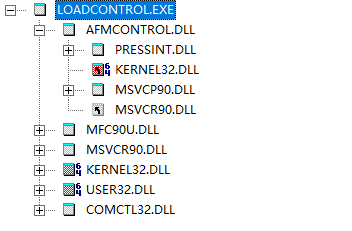
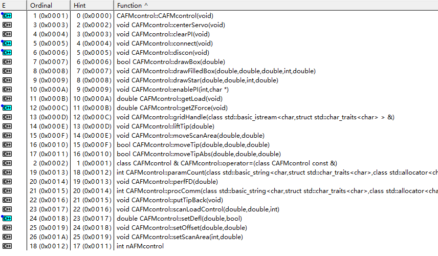

# PicoView目录文件分析

## 前言

Picoview 1.14.4是MI5500配套软件，但该软件的操作文档内容极差。对Plug-In的支持和Picoscript的解释令人费解。本文旨在分析Picoview的文档，解析其内置API。

目的：

1. 列明PicoView的AFM control模块API，形成头文件 .h 
2. 实现对AFM的Script control（备选方案：购买PicoScript-SDK）

## 主要工具

- 分析dll依赖和函数入口：Dependency Walker 2.2.6

- 分析Windows应用程序入口

     ```bash
     wmic process where caption="update.exe" get caption,commandline /value
     ```
- python的`help(Module)`命令

## 文件树

```python
│  AFMcontrol.dll     # AFM控制dll，依赖于pressInt.dll
│  CameraServer.exe   # Camera
│  CameraServer.log
│  camera_shutter_sound.wav
│  libboost_thread_win32-mgw45-mt-1_47.dll # boost库
│  libgcc_s_dw2-1.dll    # dw2库
│  libstdc++-6.dll    # stdc++库
│  license.xml
│  Load Controller Instructions.txt # 对loadControl的说明
│  loadControl.exe  # 内置控制负载的一个小程序
│  LoadController.bmp
│  log4cplusU.dll   # 日志库
│  lucamapi.dll    # LuCamera API
│  PicoView.exe   # 主程序
│  PnaSvrSetup.msi
│  pressInt.dll # 包含一些servo控制函数
│  SIDXC.dll
│  TS300SDK.dll  # camera的dll
│  unins000.dat
│  unins000.exe
│  vcredist_x86.exe # runtime
│  wxmsw28u_gcc_custom.dll # wxWidget的库
├─environment          # 定义window的显示参数
├─hardware             # 硬件配置，MI5500的配置文件为5500 AFM.xml
├─manual               # 用户手册
│  ├─open_source
│  │  ├─boost         # 主要使用的是boost开源库
│  │  ├─tinyxml       # xml解析器
│  │  └─wxWidgets     # 界面库
│  └─PicoView_User_Guide2
├─plugins               # Math 插件库，此目录下有Min_X.exe和Min_Y.exe两个默认插件，但无头文件；example_**.py插件依赖于SpectroscopyPlugIn.pyd 
├─scripts               # Script依赖于PicoScript-SDK，目前无法获得
└─USB Drivers           # 驱动

```


`loadControl.exe`提供了一个控制AFM的简单范例，分析其引用，有两个值得关注的文件：根目录下的`AFMcontrol.dll`，`pressInt.dll` ，其余的dll均为系统dll。



此外，在`plugins`目录下，`SpectroscopyPlugIn.pyd`将此目录下的所有值返回主程序。对plugin分析时，此文件也须参考。

## AFMcontrol.dll入口函数

`loadControl.exe`对`AFMcontrol.dll`的调用主要有三类五个：

```cpp
// 构造函数
CAFMcontrol::CAFMcontrol(void);
// 连接仪器和断开
void CAFMcontrol::connect(void);
void CAFMcontrol::discon(void);
// loadControl.exe功能相关：获取力值、设置defl
double CAFMcontrol::getZForce(void);
double CAFMcontrol::setDefl(double,bool);       
```
暴露的入口函数：



AFMcontrol包含了一个CAFMcontrol类及一个int型nAFMcontrol，类内包含一系列控制方法。==此dll文件应该是核心控制模块==

## pressInt.dll 入口函数

`AFMcontrol.dll` 对`pressInt.dll`的调用共七个函数：

```cpp
//构造与析构函数
pressInt::pressInt(void);
pressInt::~pressInt(void);
//初始化？
void pressInt::init(int,double,double,char*);
//动作
double pressInt::moveInt(double*,double*,double,double);
double pressInt::holdInt(double,double,double,double);
void pressInt::rotate(double);
void pressInt::writeData(void);
```
暴露的入口函数：


pressInt包含了一整个pressInt类。==该文件是底层？==

## SpectroscopyPlugIn.pyd

该文件在Dependency Walker下暴露出的接口只有initSpectroscopyPlugIn，且无参数，返回类型。但可通过python2.7的`import SpectroscopyPlugIn`导入，导入后以`help(SpectroscopyPlugIn)`命令即可看到其结构。

```cpp
CLASSES
    Boost.Python.instance(__builtin__.object)
        SpectroscopyPlugIn

    class SpectroscopyPlugIn(Boost.Python.instance)
     |  Method resolution order:
     |      SpectroscopyPlugIn
     |      Boost.Python.instance
     |      __builtin__.object
     |
     |  Methods defined here:
     |
     |  ProcessCommand(...)
     |      ProcessCommand( (SpectroscopyPlugIn)arg1) -> None :
     |
     |          C++ signature :
     |              void ProcessCommand(SpectroscopyPlugIn {lvalue})
     |
     |  RegisterProcessSpectroscopyData(...)
     |      RegisterProcessSpectroscopyData( (object)arg1, (object)arg2) -> None :     |
     |          C++ signature :
     |              void RegisterProcessSpectroscopyData(boost::python::api::object,boost::python::api::object)     |
     |  RegisterUpdateParameterList(...)
     |      RegisterUpdateParameterList( (object)arg1, (object)arg2) -> None :
     |
     |          C++ signature :
     |              void RegisterUpdateParameterList(boost::python::api::object,boost::python::api::object)     |
     |  SetParameter(...)
     |      SetParameter( (object)arg1, (str)arg2, (str)arg3) -> None :
     |
     |          C++ signature :
     |              void SetParameter(boost::python::api::object,std::string,std::string)     |
     |  SetParameterList(...)
     |      SetParameterList( (object)arg1, (list)arg2) -> None :
     |
     |          C++ signature :
     |              void SetParameterList(boost::python::api::object,boost::python::list {lvalue})     |
     |  __init__(...)
     |      __init__( (object)arg1, (list)arg2) -> None :
     |
     |          C++ signature :
     |              void __init__(_object*,boost::python::list)
     |
     |  __reduce__ = <unnamed Boost.Python function>(...)
     |
     |  ----------------------------------------------------------------------
     |  Data and other attributes defined here:
     |
     |  __instance_size__ = 16
     |
     |  ----------------------------------------------------------------------
     |  Data descriptors inherited from Boost.Python.instance:
     |
     |  __dict__
     |
     |  __weakref__
     |
     |  ----------------------------------------------------------------------
     |  Data and other attributes inherited from Boost.Python.instance:
     |
     |  __new__ = <built-in method __new__ of Boost.Python.class object>
     |      T.__new__(S, ...) -> a new object with type S, a subtype of T
```

所幸的是，官方给了调用的模板，核心的代码：

```python
import sys
import SpectroscopyPlugIn

####################### Setup --- DO NOT Change ######
plugin = SpectroscopyPlugIn.SpectroscopyPlugIn(sys.argv)

###################### 插件功能部分 ######################

# xData and yData are two data arrays from force curve
def myPlugin(xDataList,yDataList):
    data manipulation;
    return one result;

# Set unit - inform picoview to display the right unit
plugin.SetParameter("Unit", "V")

######################  DO NOT Change #######
# Pass name of processing function  
plugin.RegisterProcessSpectroscopyData(MyPlugin)
# Processing loop 
while True:
	plugin.ProcessCommand()

```

模板中对xDataList和yDataList解释为data array，应该是两个数组。那么c++形式的函数原型是否如下？


```cpp
double myPlugin(double* x, double* y)
```


==未完待续==